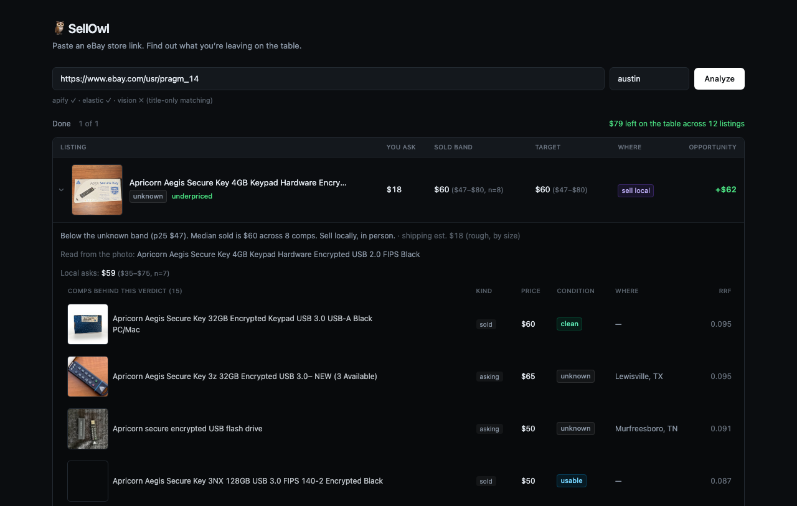

# 🦉 SellOwl

**Paste your eBay store link. Find out what you're leaving on the table.**

SellOwl reads a seller's eBay store, finds out what similar items actually
sell for — on eBay and locally on Facebook Marketplace — and tells the
seller, item by item, whether they're underpriced, overpriced, or fair, and
whether they'd net more selling on eBay or in person.

## Demo



Paste a store URL, hit **Analyze**, and within a couple of minutes every
listing gets:

- **Sold band** — the real p25–p90 price range from matched eBay sold comps
  (not a guess, and not shown at all if there aren't enough comps to trust)
- **Target price** — what to actually list it at
- **Where** — sell on eBay, or sell locally in person, whichever nets more
  after fees and shipping
- **Opportunity** — dollars left on the table if the seller does nothing
- An expandable **comp audit** under every row, so "trust me" is never the
  answer — you see the exact sold/asking comps, their condition, and their
  match score

## How it works

Three sources, joined on *meaning*, not keywords:

1. **Your store** (Apify) — what you're asking
2. **eBay sold listings** (Apify) — what things actually went for
3. **Facebook Marketplace** (Apify) — what people are asking for the same
   thing, locally, right now

Those three sources use completely incompatible schemas and vocabularies
("vintage bowl green" vs. "green ceramic bowl, vintage"), so everything gets
indexed and matched with hybrid search — keyword (BM25) fused with semantic
embeddings — so a fuzzy title still finds the right comps. Percentile price bands are computed per matched-condition cluster,
and a fee-aware venue comparison (eBay's cut + shipping vs. a free local
meetup) picks the venue that actually nets more money.

## What we used from Apify

- **[`memo23/ebay-search-scraper-ppe`](https://apify.com/memo23/ebay-search-scraper-ppe)**,
  run twice with different `mode`:
  - `mode: "active"` against a seller-search URL → the seller's own store
    listings
  - `mode: "sold"` against an `LH_Sold=1&LH_Complete=1` search URL, per item
    query → completed eBay sale prices (the "sold band" ground truth)
- **[`apify/facebook-marketplace-scraper`](https://apify.com/apify/facebook-marketplace-scraper)**,
  one run per item query per metro → local asking prices, with condition
  text, city/state, and photos
- **Apify API** directly (run an actor, poll `actor-runs` for terminal
  status, pull results from `datasets/{id}/items`) — one run per query per
  source, fanned out concurrently and bounded by a semaphore, because
  `maxItems` turned out to be a *global* cap across batched `startUrls`
  (batching one query per actor call avoids starving later queries)
- Actor run results are cached on disk (20h TTL, configurable) since runs
  take minutes and repeat identical `(actor, payload)` calls across
  re-analyses of the same store

## Search backend

Retrieval defaults to a **self-hosted SQLite backend** — FTS5 for BM25 plus
brute-force cosine over embeddings, fused with RRF. No cluster to run or pay
for, and at this scale (hundreds of comps per job) a full vector scan is
milliseconds.

Embeddings come from any OpenAI-compatible `/v1/embeddings` endpoint
(`bge-small-en-v1.5` by default, with a container in `embeddings/`). With no
endpoint reachable, retrieval degrades to a built-in lexical embedder and
`/health` reports `lexical` so the downgrade is visible rather than silent.

**Elasticsearch is still fully supported** (`SEARCH_BACKEND=elastic`) and is
what the project originally ran on. The default moved for cost, not quality:
a side-by-side on identical comps found no retrieval edge in either
direction — see [docs/MIGRATION.md](docs/MIGRATION.md), and
`backend/scripts/compare_backends.py` to re-run it.

<details>
<summary>What the original Apify × Elastic Hack Night entry used from Elastic</summary>

- **Elasticsearch** as the comp store — every scraped sold/local listing is
  indexed as a document (title, price, condition, city, photo, sold/asking)
- **`semantic_text` field mapping** — Elastic-managed inference generates
  embeddings on index, no separate embedding pipeline to run or maintain
- **Hybrid retrieval via RRF** — a `retriever` query fuses a BM25 match on
  `title`/`description` with a `semantic_text` match on the same content,
  in one `_search` call, so lookup is resilient to both exact keyword
  overlap and fuzzy/synonymous phrasing
- **Python-side RRF fallback** — on a cluster that predates the
  `retriever`/`rrf` query syntax, SellOwl detects the failure at runtime and
  falls back to running both queries separately and fusing rankings itself
  with the same reciprocal-rank-fusion formula, so the app degrades rather
  than breaking
- **Bulk API** for indexing comps, and a keyword/`copy_to` mapping so
  matched documents can be re-scored and filtered by venue and condition
  after retrieval

</details>

## Stack

FastAPI + Python 3.14 (mypy strict, ruff, mutation-tested pricing/matching
logic) · React 19 + TypeScript + Vite · Claude (vision grading + condition,
optional — the app still runs and does title-only matching without it) ·
Docker Compose

See [`docs/GOAL.md`](docs/GOAL.md), [`docs/DESIGN.md`](docs/DESIGN.md), and
[`docs/DEVELOP.md`](docs/DEVELOP.md) for the full design and dev setup.

## Try it

```bash
cp .env.example .env   # fill in APIFY_TOKEN at minimum; ELASTICSEARCH_* and ANTHROPIC_API_KEY unlock more
docker compose up
```

Or run backend/frontend locally — see `docs/DEVELOP.md`.

## What it doesn't do

Tier 3 (auto-adjusting eBay prices via the Seller API) is **dry-run only,
by design** — SellOwl renders the exact API call it *would* make and never
executes it. There is no code path in this repo that writes to eBay.
